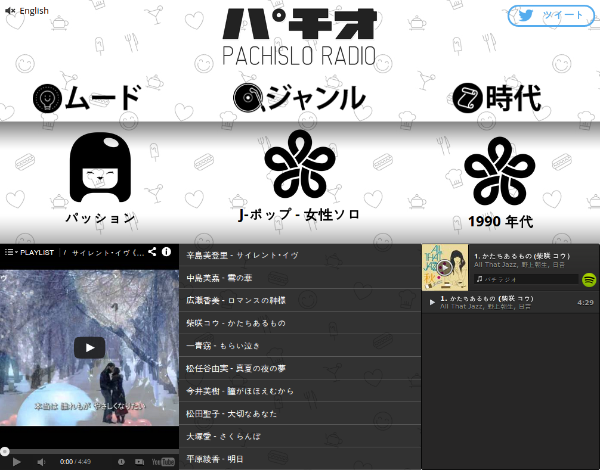

## パチ.IO / PACH.IO

Available in Japanese http://pach.io or English http://pach.io#english.

----

おまかせ検索!

スロットマシーンのラジオプレーヤー、すごく面白いよ！

----

Pachislo is a popular Japanese slot machine game that can be found in [Pachinko](http://en.wikipedia.org/wiki/Pachinko) parlors all over the country.

Pach.io stands for "Pachislo Radio". Using Gracenote's Rhythm API, it creates a different playlist on each spin, based on a random combination of Gracenote's Mood, Genre, and Era descriptors. For example, "Energizing R&B from the 90's" or "Sentimental Country from the 2000's". Music is provided by Spotify and YouTube.

Spin the wheel and find a combination you enjoy!

----

Built by [Rich Adams](https://twitter.com/r_adams), designed by [Israel Sundseth](https://twitter.com/kappuru). Powered by [Gracenote Rhythm API](https://developer.gracenote.com/rhythm-api), also uses [YouTube](https://developers.google.com/youtube/) and [Spotify](https://developer.spotify.com/technologies/web-api/) APIs. Built in 24-hours for [Music Hack Day Tokyo 2014](https://www.hackerleague.org/hackathons/music-hack-day-tokyo-2014).
